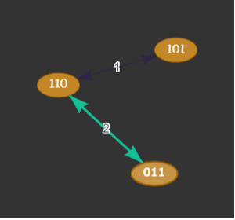

# Town of salem
## Introduction
Town of Salem is an online browser game that pits players against each other in a game of intrigue and mystery. 

The premise is that there is a town populated by two types of villagers: townspeople and mobsters. The purpose of the game is to lynch every mobster, or kill all townspeople depending on the role of the player.
Each player is assigned either faction in secrecy at the beginning of the game. Mobsters know who the other mobsters are. Townspeple don't know who the other townspeople or mobsters are. There are more townspeople than mobsters. The game transitions between day and night sequences where unique interactions take place between the villagers.
The day is split into two phases. Initially, everyone gathers in the town square and is able to exchange information between each other publicly. Then, a lynching phase is initiated in which villagers vote who to lynch during that day. If there is a majority, the person is put on trial and can argue for their life. A final vote to decide to kill them is initiated. If a person is lynched, they're out of the game. Once a person dies in this game, their role is revealed to everybody.
During the night, villagers of certain roles may visit other villagers and interact with them. Although the original game offers 48 unique roles with interactions we thought to propose a subset of that. 

For our project we would like to implement multi-agent simulation based on the Town of Salem. Like the original game simulation will have a set of agents with assigned role and a goal of eliminating the other faction. In the simulation we use the same set of agents for every game. The agents will try to use logical reasoning to vote based on some knowledge and on top of that try to learn which world is the real world. We also want to add an alternative win condition for the villagers: if two/three(number if under consideration right now) villagers know the real world then the mafia also loses the game(fbi gets called to aid the villagers). In our simulation when the agent dies his faction is revealed and if the agent was a villagers his knowledge also becomes known(last will). Both parts use public announcements to distribute new knowledge.

### Roles 

**Villagers**

1.Doctor - Heals one person per night preventing them from dying. Can self heal only once.

2.Lookout - Watch one person at night to see who visits them.

3.Sheriff - Check one person each night for suspicious activity.(Reveals if the person is with town or with mafia faction).Roles with Detection Immunity, notably the Godfather, cannot be found.

4.Mayor - Gain 3 votes when you reveal yourself as Mayor.You cannot be healed by a Doctor once you reveal yourself.

5.Bodyguard - You can protect your target from one attack during the night and counterattack their attacker. You will die if this 
happens. If you target yourself, you will use your bulletproof vest, gaining a temporary Basic defense.Your vest does not act like a guard; you will not counterattack any attackers.

**Mafia**

6.Godfather - You can pick a target to attack each night.If there is a Mafioso (and they are not role blocked that night), then they will do the killing for you.If a Mafioso is alive when you die, the Mafioso will be promoted to Godfather.If there is no Mafioso when you die, whichever member of the Mafia joins the lobby first will be promoted to a Mafioso.

7.Mafioso - Each night, you can pick one person to vote to kill; however, if there is a Godfather and they pick someone else, their decision will override yours, and you will attack their target instead.

We also thinking about replacing some of the original roles with roles that would benefit or interact with logical model more

### ***Potential roles***

**Villagers**

9.Oracle - oracle is capable of acquiring some/all knowledge of other agent in the simulation(amount of knowledge learned is currently under consideration). For an agent it chooses an agent and gets all or part of his knowledge(most likely part due to balancing of the game) 

10.FBI agent - this role is an alternative to an alternative win condition. To win FBI agent need to discover the real world while at least one other villager is alive. Questioning action is available for FBI agent. FBI Agent questions another agent A and gets his knowledge about the agent B.

**Mafia**

11.Interrogator - Interrogates a targed and acquires its knowledge. Then shares it with the rest of the mafia.

Most likely we will replace framer with interrogator since it will also remove false knowledge from the model and maybe just add a new villager role if this will not complicate the model by a lot.

## Setup
We use python multi-agent library [MESA](https://github.com/projectmesa/mesa) for agent based modeling and [mlsolver](https://github.com/erohkohl/mlsolver) library for building and updating kripke model.

### Run instructions
1. `pip3 install mesa --user`
2. `git clone https://github.com/uberVelocity/Town-Of-Salem.git`
3. `cd Town-Of-Salem`
4. `cd project`
5. `python3 main.py <num_of_runs> <interaction_mode>`
where `num_of_runs` constitutes the number of games to simulate (`num_of_runs` := 1..N | N is a natural number) and `interaction_mode` shows the interaction of each villager during every `round` of `every` game. This flag can take any string and interaction mode will be enabled. It is recommended to use interaction mode when running only `one` round to easily track the progress of the simulation. The results are saved automatically after every `run` inside the `results` file. Even if the simulation is stopped midway, the progress of the results are saved in `results`.

### Game setup
The game consists of two phases:

**Action phase** where all the agents perform the action simultaneously and try to update their knowledge based on that.

**Voting phase** where agents choose who to lynch and vote yes and no for lynching of that person.

### Preliminary results
The game currently simulates the interactions between the townspeople using a random function. As such, no deliberations are being made on their decisions as of yet. Nevertheless, `100000` runs of the simulation have been run, upon which the results can be seen in the [results file](https://github.com/uberVelocity/Town-Of-Salem/blob/master/project/results).

## Epistemic model
We want to model this game using epistemic logic. Given the set of agents {1..n}, formulae will be of the form (a,b) where a is a set {0..n-1} and b is {0,1}, where 0 means that the agent a is a villager and 1 means that the agent is a mafia. For now we use the game with 8 total agents with 5 of them being the villagers and 3 - mafia. A Kripke model will consist of set of all possible world for every possible combination with constraints of number of factions and the fact that the mafia knows the true world from the beginning. 
An example of one of the world is - 11100000 which suggests that in that world agents 0-2 are mafia and the rest of the agents are villagers. In general we would have 2^n worlds but due to initial restrictions this number will be reduced by quite a bit. During the simmulation the complexity of the model will be reduced since most of the agents will acquire some knowledge during the game and that in turn will remove some of the existing relations in a model. On top of that every agent also has a knowledge base to be able to represent higher level knowledge. Initially villagers only know their faction and mafia knows everyones faction. 

A simplified example of a world with 3 agents can be seen below. Agents 1,2 are the villagers while the agent 3 is mafia. In this example villager is represented by 1 and mafia is 0. As we can see both villagers can not distinguish between two world(world 110 is the real world)

An example of acquired knowledge can be a public announcement of the faction of lynched person or his last will. Using this knowledge Kripke model is reduced by removing relations that would contradict this knowledge. Agents may also get some knowledge from their actions. For example if lookout checks agent A and agent A visited agent B and agent B ended up dead lookput may infer that agent A is mafioso. Other example would be if the doctor visited agent A and he received a message that agent A survived thanks to his intervention the doctor may conclude that agent A is not a mafia(technically it is possible for mafioso to target another member of mafia but for simplicity we assumed that mafia do not kill its members).
There might be a possiblity that some agents may acquire conflicting knowledge that still may reduce the compexity of a model(lookout seeing nultiple persons visiting the same agent) in this case an OR formula is built.

### Higher order knowledge
Higher order knowledge is not used that much in a simulation with the original role but it is important for the version with our sutom roles. Custom roles allows agents to acquire knowledge about agents knowledge and based on that knowledge they may alter their actions. We think of implementing different strategies regarding the last will(reveal of the knowledge after the death of an agent) but in the original variant mafia does not want to kill the villagers who know more information about mafia, because in that case that knowledge will become known to everyone via public announcement. On the other hand if we have a no last will variant of the game the mafia want to kill the person with the most knowledge about the mafia.

### Voting: knowledge and beliefs
Based on the voting agents may try to make an educated guess about the faction of a voter. if agent B voted for lunching of an agent A then we might suspect that agent B is a mafia, but it is not concrete knowledge. On top of that if mafia knows that they might be suspected they may try to change their voting behaviot to confuse the villagers. Multiple strategies can be implemented depending on what order of knowledge factions will try to use.

## Current progress
Currently we have multi-agent model with most of the actions and separate kripke model, but right now agents act randomly. Acting based on the knowledge and updating the knowledge and Kripke model based on the actions are curently not implemented.
