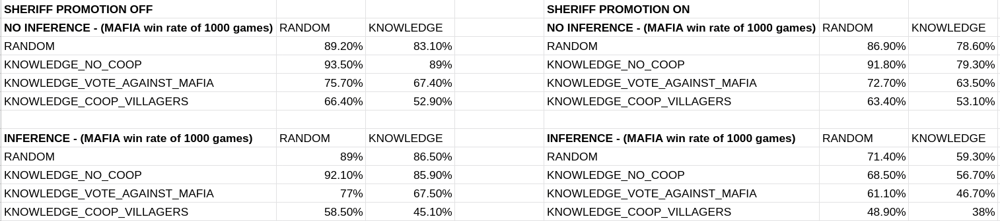

# Town of salem
## Introduction
Town of Salem is an online browser game that pits players against each other in a game of intrigue and mystery. 

The premise is that there is a town populated by two types of villagers: townspeople and mobsters. The purpose of the game is to lynch every mobster, or kill all townspeople depending on the role of the player.
Each player is assigned either faction in secrecy at the beginning of the game. Mobsters know who the other mobsters are. Townspeople don't know who the other townspeople or mobsters are. There are more townspeople than mobsters. The game transitions between day and night sequences where unique interactions take place between the villagers.
The day is split into two phases. Initially, everyone gathers in the town square and is able to exchange information between each other publicly. Then, a lynching phase is initiated in which villagers vote who to lynch during that day. If there is a majority, the person is put on trial and can argue for their life. A final vote to decide to kill them is initiated. If a person is lynched, they're out of the game. Once a person dies in this game, their role is revealed to everybody.
During the night, villagers of certain roles may visit other villagers and interact with them. Although the original game offers 48 unique roles with interactions we thought to propose a subset of that. 

For our project we would like to implement multi-agent simulation based on the Town of Salem. Like the original game simulation will have a set of agents with assigned role and a goal of eliminating the other faction. In the simulation we use the same set of agents for every game. The agents will try to use logical reasoning to vote based on some knowledge and on top of that try to learn which world is the real world. 

### Roles 

**Villagers**

1. Doctor - Heals one person per night preventing them from dying. Can self heal only once.
2. Lookout - Watch one person at night to see who visits them.

3. Sheriff - Check one person each night for suspicious activity.(Reveals if the person is with town or with mafia faction).Roles with Detection Immunity, notably the Godfather, cannot be found. (Alternative role fbi agent)

4. Mayor - Gain 3 votes when you reveal yourself as Mayor. You cannot be healed by a Doctor once you reveal yourself.

5. Bodyguard - You can protect your target from one attack during the night and counterattack their attacker. You will die if this 
happens. If you target yourself, you will use your bulletproof vest, gaining a temporary Basic defence. Your vest does not act like a guard; you will not counterattack any attackers.

**Mafia**

6. Godfather - You can pick a target to attack each night. If there is a Mafioso (and they are not role blocked that night), then they will do the killing for you. If a Mafioso is alive when you die, the Mafioso will be promoted to Godfather. If there is no Mafioso when you die, whichever member of the Mafia joins the lobby first will be promoted to a Mafioso.
7. Mafioso - Each night, you can pick one person to vote to kill; however, if there is a Godfather and they pick someone else, their decision will override yours, and you will attack their target instead.
8. Back up - a member of Mafia that becomes a mafioso if both godfather and mafioso are dead.

## Setup
We use python multi-agent library [MESA](https://github.com/projectmesa/mesa) for agent based modeling and [mlsolver](https://github.com/erohkohl/mlsolver) library for building and updating kripke model.

### Run instructions
1. `pip3 install mesa --user`
2. `git clone https://github.com/uberVelocity/Town-Of-Salem.git`
3. `cd Town-Of-Salem`
4. `cd project`
5. `python3 main.py <num_of_runs> <interaction_mode>`
where `num_of_runs` constitutes the number of games to simulate (`num_of_runs` := 1..N | N is a natural number) and `interaction_mode` shows the interaction of each villager during every `round` of `every` game. This flag can take any string and interaction mode will be enabled. It is recommended to use interaction mode when running only `one` round to easily track the progress of the simulation. The results are saved automatically after every `run` inside the `results` file. Even if the simulation is stopped midway, the progress of the results are saved in `results`.

### Game setup
The game consists of two phases:

**Action phase** where all the agents perform the action simultaneously and try to update their knowledge based on that.

**Voting phase** where agents choose who to lynch and vote yes and no for lynching of that person.

## Epistemic model
Agents are represented as a set of propositional atoms(q,r etc.) where each propositional atom corresponds to one agent. Truth value of this propositional atom defines faction of an agent. If the atom is true the agent is a mafia, otherwise the agent is a villager. Kripke model consists of all possible worlds and relations between those worlds for each agent. For the sake of simplicity of implementation in our simulation world was represented by a string of 0s and 1s under assumptions that ith element of a string corresponds to some propositional atom. Set of relations was represented as a set of tuples between two indistibguishable worlds for each agent.

An example of one of the world is - 11100000 which suggests that in that world agents 0-2 are mafia and the rest of the agents are villagers. In general we would have 2^n worlds but due to initial restrictions this number will be reduced by quite a bit. During the simmulation the complexity of the model will be reduced since most of the agents will acquire some knowledge during the game and that in turn will remove some of the existing relations in a model. On top of that every agent also has a knowledge base to be able to represent higher level knowledge. Initially villagers only know their faction and mafia knows everyones faction. 

A simplified example of a world with 3 agents can be seen below. Agents 1,2 are the villagers while the agent 3 is mafia. In this example villager is represented by 1 and mafia is 0. As we can see both villagers can not distinguish between two world(world 110 is the real world)

There are two ways of acquiring knowledge in the game: via public announcement or via private announcement. Public announcements generally happen when one of the agents die. In that case the faction of the dead agent becomes known to everyone. Another situation when we distribute information using public announcements is an action of revealing a Major. If the Major decides to reveal himself his faction becomes known to everyone.

During the game based on their actions agents can acquire knowledge that is only available to themselves. That information is added using private announcements. For example if lookout checks agent A and agent A visited agent B and agent B ended up dead lookout may infer that agent A is mafioso. Other example would be if the doctor visited agent A and he received a message that agent A survived thanks to his intervention the doctor may conclude that agent A is not a mafia(technically it is possible for mafioso to target another member of mafia but for simplicity we assumed that mafia do not kill its members).

There might be a possibility that some agents may acquire conflicting knowledge that still may reduce the complexity of a model(lookout seeing multiple persons visiting the same agent) in this case an OR formula is built.

When agents acquire new information in any way we remove all relations from the Kripke model that contradicts new information.

### Higher order knowledge
For most part of the simulation higher order is not used by the agents. Normally they only consider the knowledge that they have on their own but it is used if coop voting strategy is used. This will be described in more detail in voting part of the report.

### Action models

In our simulation we haven't explicitly used action models. We modelled private announcement by removing corresponding relations from a Kripke model. Also defining action model for all possible actions would be quite problematic in out case given the variety of actions and outcome of those actions. Here we want to show a small part of ideal action model: action model for a sheriff action of inspecting agent 0.

We define set of agents {A,B,C,D,E,F,G,H}.

Then propositions are: 1a: A is a villager, 0a: A is mafioso. Similarly for all the other agents.

Initial model would be hard to represent fully since it would consist of 50+ possible worlds so we will look at a subset of the following worlds

Here we show only two worlds out of the whole subset of worlds.(00111000 and 10101000).

When sheriff inspect agent A he can learn if agent A's faction and as a result can distinguish those worlds. We can have a structure (Inspect,A) that corresponds to sheriff inspecting agent A.  State 00111000 is the result of executing action 0a and 10101000 is the result of executing 1a(of course its effects are more complicated in the whole model but for simplicity we look only at those two worlds). No one apart from sheriff can distinguish those worlds based on that action(Apart from agent A because obviously agent A know his own faction, but it is no connected to an action).

This action would give us additional worlds that would be indistinguishable for agents other than a sheriff. 

### Voting strategies
In total we implemented 4 voting strategies for the agents:

- Random

  In random strategies agent simply choses random agent that is not himself and vote for that agent.

- Knowledge no coop

  In knowledge no coop agents try to use knowledge of other agents faction. With this strategies villagers never note for an agent if they know that that agent is another villager. Mafia never votes for another mafia member. Apart from those restrictions vote is still random.

- Knowledge vote against mafia

  This strategy is similar to the previous one with one important distinction. In the previous strategy villager never voted for another villager but in this one is villagers knows that one of the other agents is mafia, villagers always votes against mafia. In case villager knows 2 or more mafia members target is chosen randomly. Mafia votes in the same way as in knowledge no coop.

- Knowledge coop villagers

  This is the only strategy that uses reasoning about other agents knowledge. For that strategy voting was changed from simultaneous to sequential for the villagers. This strategy works in the following way: when a villager needs to vote he first tries to observe the previous votes of other agents. After that villager check if some of those agents are villagers. If they are villagers agent assumes that they vote truthfully and that they try to eliminate mafia members and the agent votes the same as previous villager. If agent knows multiple villagers and they voted differently agent choses the most common option or random one among the most common one in case of a tie. If agent does not have information about previous agents faction he follows vote against mafia strategy. Mafia still uses the same voting strategy as in previous 2 examples.

### Other simulation options

- Action strategy

  There are two possible options for actions.

  1. Actions are chosen completely randomly
  2. Actions are chosen somewhat reasonably using agents knowledge. With this option agents will try to maximize outcome of their actions: sheriff will try to inspect different targets to learn their faction, bodyguard and doctor will try to protect villagers etc.

- Inference

  Initially we always followed the same pattern between knowledge and Kripke model: acquire new knowledge-> add it to knowledge base->remove unnecessary relations from a Kripke model. But that misses an important part, at one point Kripke model is reduced enough to get new information out of it and add it to the knowledge. If this option is ON we assume that the agents are perfect logicians and they are able to infer information from the Kripke model

- FBI promotion for a sheriff

  Initially Mafia was favourite in most of our simulations so we though of a way to even the odds and we also wanted it to be related to the knowledge.

  If this option is ON then the town get an alternative win condition with an alternative sheriff role: if sheriff manages to learn faction of all alive agents and if at least one other villager is alive at that point then the town wins against mafia. With this option we assume that if sheriff knows everything he request a back up and eliminates the mafia

### Results

### Discussion

As we can see from the results if we add more knowledge to the agents and if they use this knowledge in a reasonable way the town's win percentage increases with and increase of acquired and used knowledge. There is one interesting point: when we change voting strategy from random to knowledge no coop the mafia's winrate actually increases but that happens because between this strategies mafia also starts to use its knowledge and since mafia has all the knowledge from the beginning of the game it makes mafia's victory even more probable. In all other cases increase in the use of knowledge leads to and increase of town's winrate.
